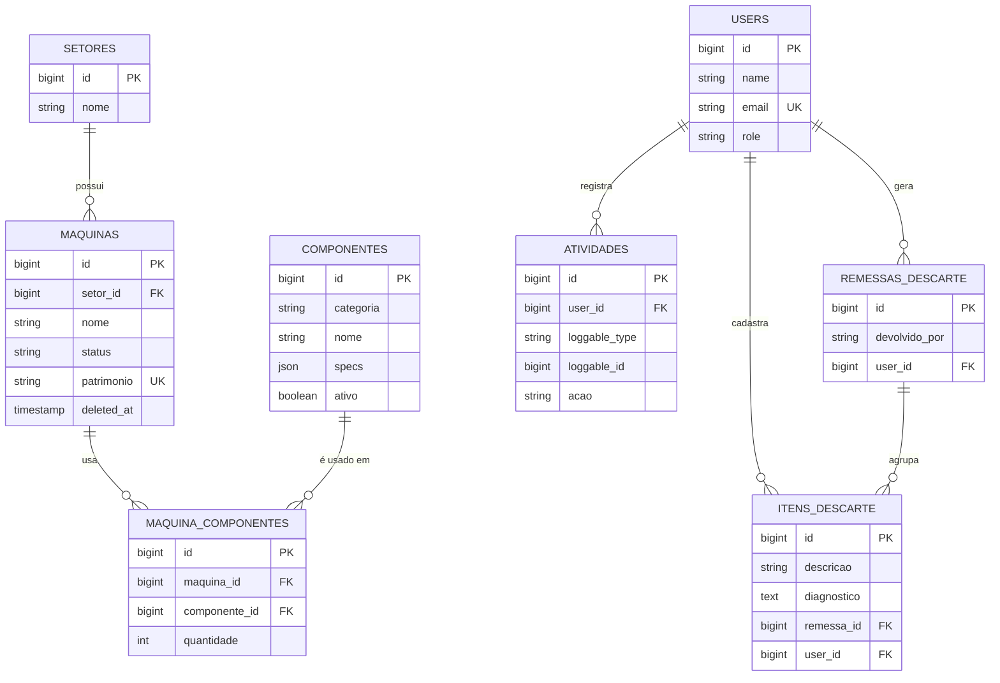

# Banco de dados

Referência do esquema do Central PC (Postgres). Cobre as 8 tabelas de domínio — as tabelas de
infraestrutura do Laravel (`sessions`, `cache`, `cache_locks`, `jobs`, `job_batches`,
`failed_jobs`, `migrations`, `password_reset_tokens`, `personal_access_tokens`) não estão listadas
aqui: são geradas pelo framework, não fazem parte da regra de negócio, e seu formato é padrão do
Laravel.

Este documento é escrito à mão a partir do estado atual das migrations — **atualize-o manualmente**
sempre que o esquema mudar (mesma disciplina de manter `docs/superpowers/specs/` em dia por
feature).

## Diagrama

## Tabelas

### `setores`

Departamentos/setores da instituição. Só `nome`. Toda `maquina` pertence a um setor
(`setor_id` obrigatório); um setor com máquinas vinculadas não pode ser excluído
(`SetorController::destroy` bloqueia isso na aplicação — não há `ON DELETE RESTRICT` explícito no
banco).

### `maquinas`

Tabela central do inventário. Pontos que não são óbvios pelo nome da coluna:

- `status`: enum de aplicação (`App\Enums\StatusMaquina`) guardado como string — `ativa`,
  `manutencao` ou `baixada`.
- `patrimonio`: opcional, mas único quando preenchido (`maquinas_patrimonio_unique`).
- `deleted_at`: soft delete (Laravel `SoftDeletes`) — é a "lixeira" da tela de máquinas. Registro
  soft-deleted continua no banco e pode ser restaurado.
- `observacoes`: texto livre; historicamente usado também para anotar coisas como IP e GPU antes de
  existir cadastro estruturado pra isso (ver migração de dados legados em
  `docs/superpowers/specs/2026-07-13-catalogo-componentes-compatibilidade-design.md`). Não
  normalizado — pode conter informações soltas.
- `foto_path`: caminho relativo no disco (`storage/app/public`), não a URL pronta.

### `componentes`

Catálogo de **tipos** de hardware reutilizáveis (ex.: "Intel Core i5-10400"), não unidades físicas
individuais — várias máquinas podem apontar pro mesmo componente através de `maquina_componentes`.

- `categoria`: enum de aplicação (`App\Enums\CategoriaComponente`) — `cpu`, `placa_mae`, `ram`,
  `armazenamento`, `gpu`, `fonte`, `gabinete`.
- `specs`: JSON cujas chaves esperadas dependem de `categoria` (ver
  `CategoriaComponente::camposDeSpecs()`) — não há validação de schema JSON no banco, só na
  aplicação.
- `ativo`: desativa o componente para novos cadastros de máquina sem apagar o histórico de quem já
  usa ele.

Peças físicas quebradas/descartadas **não** passam por aqui — isso é o par
`itens_descarte`/`remessas_descarte`, um subsistema separado (ver abaixo).

### `maquina_componentes`

Tabela de associação `maquinas` ↔ `componentes`, com `quantidade` (permite, por exemplo, 2 pentes
de RAM do mesmo modelo numa máquina).

### `users`

Autenticação padrão do Laravel + `role` (`App\Enums\RoleUsuario`: `admin`, `tecnico`, `leitura`),
usada pelos gates `editar` (admin + técnico) e `excluir` (só admin) em
`AppServiceProvider::boot()`.

### `atividades`

Log de auditoria polimórfico (`Atividade::registrar()`), usado por Máquinas, Setores, Componentes e
Descarte. `loggable_type` + `loggable_id` apontam pro registro afetado (`morphTo`); `acao` é uma
string livre (`criado`, `atualizado`, `excluido`, ...). Só tem `created_at` — não é editável depois
de criado (`const UPDATED_AT = null` no model). `user_id` é nullable porque a ação pode, em tese,
vir de um contexto sem usuário autenticado (seeder, comando artisan).

### `itens_descarte` / `remessas_descarte`

Fluxo de devolução de peças quebradas ao almoxarifado (Anexo 7) — ver
`docs/superpowers/specs/2026-07-18-descarte-componentes-design.md` para o desenho completo.

- Uma peça começa em `itens_descarte` com `remessa_id` nulo (= "na fila, aguardando devolução").
- Ao gerar uma remessa, os itens selecionados ganham `remessa_id` apontando pra um registro de
  `remessas_descarte` — a partir daí ficam imutáveis (sem tela de edição/remoção).
- `remessas_descarte.devolvido_por` é o nome do usuário **congelado** no momento da geração (não é
  uma FK pro nome atual do usuário — se o usuário for renomeado depois, o histórico da remessa não
  muda).

## Índices

Toda coluna de chave estrangeira tem um índice próprio (`maquinas.setor_id`,
`maquina_componentes.maquina_id`/`componente_id`, `atividades.user_id`,
`itens_descarte.user_id`/`remessa_id`, `remessas_descarte.user_id`) — adicionados em
`2026_07_18_120000_add_missing_foreign_key_indexes.php`. O Postgres, diferente do MySQL, não cria
esses índices automaticamente ao criar uma FK.

Únicos: `users.email`, `maquinas.patrimonio` (índice único padrão — o Postgres não trata `null`
como igual a outro `null`, então múltiplas máquinas sem patrimônio preenchido convivem sem
conflito).

## Backups

Não há rotina automatizada hoje. Existem dumps manuais avulsos em `storage/backups/` (fora do
controle de versão — pasta no `.gitignore`), feitos antes de migrations arriscadas. Formato:
`pg_dump` (`.dump`), restaurável com `pg_restore`.
